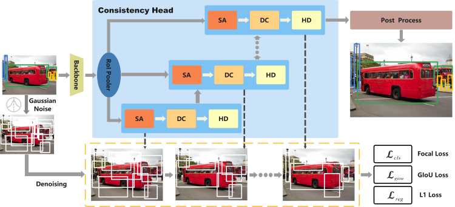
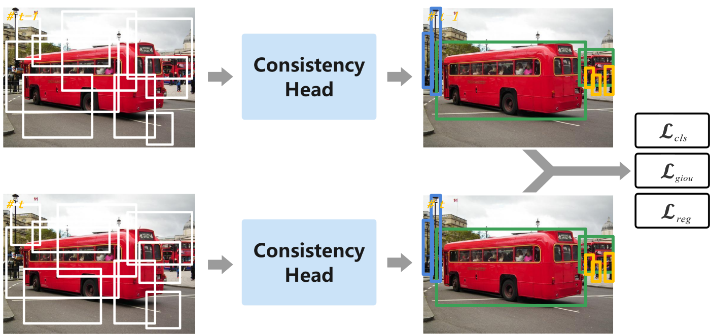

# ConsistencyDet: Robust Object Detector with Denoising Paradigm of Consistency Model
Lifan Jiang,Zhihui Wang*,Changmiao Wang,Ming Li,Jiaxu Leng,Xindong Wu

## 1.Network Structure and Detection Results
### 1.1 Structure of the ConsistencyDet

### 1.2 The self-consistency of ConsistencyDet

### 1.3 Partial Detection Results on the COCO Dataset

## 2.Abstrat

Object detection, one of the representative perception tasks, can be addressed through a generative approach. We propose ConsistencyDet, a framework formulating object detection as a denoising diffusion process from noisy boxes to object boxes. It introduces a novel denoising paradigm, Consistency Model, characterized by self-consistency. This property enables the model to map noise at any point on the timeline directly to the origin, achieving a ``one-step denoising" effect. This significantly enhances the model's runtime efficiency compared to the diffusion model. During training, ConsistencyDet starts the diffusion process with noisy boxes generated from ground-truth boxes and trains the model to map these noisy boxes back to their corresponding ground-truth boxes. In the inference phase, ConsistencyDet utilizes denoising sampling, beginning with boxes sampled from a Gaussian distribution. The model progressively refines a set of randomly generated boxes to produce the final output results. The extensive evaluations on standard benchmarks, including MS-COCO and LVIS, demonstrate that ConsistencyDet outperforms previous well-established detectors.

## 3.Experimental results
<table border="1">
  <tr>
    <th>Method</th>
    <th>The best Box AP</th>
    <th>Download</th>
  </tr>
  <tr>
    <td>COCO-Res50</td>
    <td>46.9</td>
    <td><a href="https://pan.baidu.com/s/14GFs5oBZeV6XWk6xiNDmXg?pwd=1111">model</a></td>
  </tr>
  <tr>
    <td>COCO-Res101</td>
    <td>47.2</td>
    <td><a href="https://pan.baidu.com/s/1Rj7TMGt1cOBubkRutypObA?pwd=1111" download>model</a></td>
  </tr>
  <tr>
    <td>COCO-SwinBase</td>
    <td>53.0</td>
    <td><a href="https://pan.baidu.com/s/1zgfJip_HSx0FAB4EiyX8tA?pwd=1111" download>model</a></td>
  </tr>
  <tr>
    <td>LVIS-Res50</td>
    <td>32.2</td>
    <td><a href="https://pan.baidu.com/s/19ELAf3xNf6uYtILmyFFmvQ?pwd=1111" download>model</a></td>
  </tr>
  <tr>
    <td>LVIS-Res101</td>
    <td>33.1</td>
    <td><a href="https://pan.baidu.com/s/1wXPChzSKMVRHiB7DYDsG3Q?pwd=1111" download>model</a></td>
  </tr>
  <tr>
    <td>LVIS-SwinBase</td>
    <td>42.4</td>
    <td><a href="https://pan.baidu.com/s/1KpT-3ktSYM_R1n5hBn8Nsw?pwd=1111" download>model</a></td>
  </tr>
</table>

## 4.Installation
1.Install anaconda, and create conda environment;
<pre>
conda create -n yourname python=3.8
</pre>
2.PyTorch ≥ 1.9.0 and torchvision that matches the PyTorch installation. You can install them together at [pytorch.org](https://pytorch.org/) to make sure of this.
3.Install Detectron2
<pre>
git clone https://github.com/facebookresearch/detectron2.git
python -m pip install -e detectron2
</pre>
4.Install other dependency libraries
<pre>
pip3 install -r requirements.txt
</pre>

## 5.Data preparation
<pre>
mkdir -p datasets/coco
mkdir -p datasets/lvis

ln -s /path_to_coco_dataset/annotations datasets/coco/annotations
ln -s /path_to_coco_dataset/train2017 datasets/coco/train2017
ln -s /path_to_coco_dataset/val2017 datasets/coco/val2017

ln -s /path_to_lvis_dataset/lvis_v1_train.json datasets/lvis/lvis_v1_train.json
ln -s /path_to_lvis_dataset/lvis_v1_val.json datasets/lvis/lvis_v1_val.json
</pre>

## 6.Prepare pretrain models
<pre>
mkdir models
cd models
# ResNet-101
wget https://github.com/ShoufaChen/DiffusionDet/releases/download/v0.1/torchvision-R-101.pkl

# Swin-Base
wget https://github.com/ShoufaChen/DiffusionDet/releases/download/v0.1/swin_base_patch4_window7_224_22k.pkl
</pre>

## 7.Training
<pre>
python train_net.py --num-gpus 4 \
  --config-file configs/diffdet.coco.res50.yaml
</pre>

## 8.Evaling
<pre>
python train_net.py --num-gpus 4 \
  --config-file configs/diffdet.yourdataset.yourbakbone.yaml \
  --eval-only MODEL.WEIGHTS path/to/model.pth
</pre>

## 9.Citation
@misc{jiang2024consistencydet,
      title={ConsistencyDet: Robust Object Detector with Denoising Paradigm of Consistency Model}, 
      author={Lifan Jiang and Zhihui Wang and Changmiao Wang and Ming Li and Jiaxu Leng and Xindong Wu},
      year={2024},
      eprint={2404.07773},
      archivePrefix={arXiv},
      primaryClass={cs.CV}
}

## 10.Acknowledgement
A large part of the code is borrowed from DiffusionDet and Consistency models thanks for their works.
<pre>
@inproceedings{chen2023diffusiondet,
  title={Diffusiondet: Diffusion model for object detection},
  author={Chen, Shoufa and Sun, Peize and Song, Yibing and Luo, Ping},
  booktitle={Proceedings of the IEEE/CVF International Conference on Computer Vision},
  pages={19830--19843},
  year={2023}
}
@article{song2023consistency,
  title={Consistency models},
  author={Song, Yang and Dhariwal, Prafulla and Chen, Mark and Sutskever, Ilya},
  journal={arXiv preprint arXiv:2303.01469},
  year={2023}
}
</pre>

